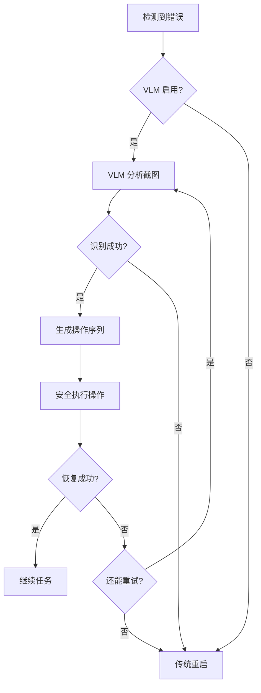

# VLM 智能游戏控制器使用指南

## 简介

VLM (Vision-Language Model) 智能游戏控制器是 Alas 的创新功能，使用视觉语言模型（如 GPT-4V、Claude 3.5 Sonnet、Gemini）**自动分析和处理游戏卡死/错误界面**，避免简单粗暴的重启策略。

### 核心能力

- 🔍 **视觉理解**：理解游戏界面的语义内容，不依赖固定模板
- 🧠 **智能决策**：分析卡死原因（网络弹窗、公告、资源不足等）
- 🎮 **自主操作**：生成并执行点击、等待等操作序列自动恢复
- 🛡️ **安全降级**：VLM 失败时自动回退到传统重启策略

## 安装依赖

VLM 控制器需要额外的 Python 库，根据你选择的 VLM 提供商安装：

### OpenAI (GPT-4o / GPT-4o-mini)

```bash
pip install openai>=1.0.0
```

### Anthropic (Claude 3.5 Sonnet)

```bash
pip install anthropic>=0.18.0
```

### Google (Gemini 2.0 Flash)

```bash
pip install google-generativeai>=0.3.0
```

## 配置方法

1. **启用 VLM 控制器**

在 Alas UI 中找到 `VLMGameController` 配置组：

| 配置项                  | 说明                | 推荐值                                          |
| ----------------------- | ------------------- | ----------------------------------------------- |
| **Enable**              | 是否启用 VLM 控制器 | `false`（首次测试时建议先关闭）                 |
| **Provider**            | VLM 提供商          | `openai` / `claude` / `gemini`                  |
| **Model**               | 模型名称            | `gpt-4o-mini`（性价比） 或 `gpt-4o`（高准确率） |
| **APIKey**              | API 密钥            | 从对应平台获取                                  |
| **BaseURL**             | 自定义 API 地址     | 默认留空，使用官方地址                          |
| **MaxRecoveryAttempts** | 最大尝试次数        | `3`                                             |
| **Timeout**             | API 超时时间（秒）  | `30`                                            |
| **EnableActionLogging** | 记录操作日志        | `true`                                          |

2. **获取 API Key**

- **OpenAI**: https://platform.openai.com/api-keys
- **Anthropic**: https://console.anthropic.com/settings/keys
- **Google Gemini**: https://aistudio.google.com/app/apikey

3. **测试配置**

建议先在**非关键任务**上测试（如 Daily），观察 VLM 的表现。

## 工作原理

### 触发条件

VLM 控制器会在以下情况下自动触发：

1. **GameStuckError / GameTooManyClickError**：游戏卡死，点击无响应
2. **GamePageUnknownError**：进入未知界面，无法识别当前页面

### 执行流程



### 示例场景

#### 场景 1：网络重连弹窗

```
[错误] GameStuckError 触发
[VLM] 识别场景：network_error_dialog
[VLM] 发现元素：{"type": "button", "text": "重试", "position": [640, 360]}
[操作] 点击坐标 [640, 360]
[结果] ✓ 成功恢复，继续任务
```

#### 场景 2：活动公告弹窗

```
[错误] GamePageUnknownError 触发
[VLM] 识别场景：announcement_popup
[VLM] 建议操作：点击"我知道了"按钮
[操作] 点击坐标 [640, 420]
[结果] ✓ 成功关闭弹窗
```

#### 场景 3：资源不足提示

```
[错误] GameStuckError 触发
[VLM] 识别场景：resource_insufficient
[VLM] 诊断：燃料不足，无法出征
[VLM] 建议操作：点击取消 -> 自动调度 Reward 任务
[结果] ✓ 跳过当前任务，优先领取奖励
```

## 成本估算

### 单次诊断成本

| 模型              | 输入成本  | 输出成本  | 总计         | 备注           |
| ----------------- | --------- | --------- | ------------ | -------------- |
| GPT-4o-mini       | ~$0.00008 | ~$0.00012 | **~$0.0002** | 推荐性价比之选 |
| GPT-4o            | ~$0.0025  | ~$0.0012  | **~$0.0037** | 复杂场景使用   |
| Claude 3.5 Sonnet | ~$0.0015  | ~$0.0015  | **~$0.003**  | 推理能力强     |
| Gemini 2.0 Flash  | **免费**  | **免费**  | **免费**     | 推荐高频使用   |

### 月度估算

假设每天触发 5 次错误恢复：

- **GPT-4o-mini**: 5 × 30 × $0.0002 ≈ **$0.03/月** (约 ¥0.2/月)
- **Gemini 2.0 Flash**: **完全免费**

## 安全机制

### 1. 防止无限循环

- 记录最近 5 次操作历史
- 检测到 3 次相同操作自动中止
- 单次恢复最多 3 次尝试

### 2. 坐标验证

- 所有点击坐标都会验证是否在屏幕范围内
- 基于 1280x720 的坐标会自动缩放到实际分辨率

### 3. 降级策略

```
VLM 恢复 (尝试 1-3 次)
  ↓ 失败
传统重启策略
```

### 4. 隐私保护

- 截图经过 `handle_sensitive_image()` 脱敏处理
- API Key 存储在本地配置文件
- 默认禁用，需要用户主动开启

## 故障排查

### 问题 1：VLM 控制器未触发

**可能原因**：

- `Enable` 未设置为 `true`
- API Key 未配置或错误

**解决方法**：

1. 检查配置项是否正确
2. 查看日志中是否有 `"检测到游戏卡死，尝试使用 VLM 智能恢复..."` 信息

### 问题 2：API 调用失败

**可能原因**：

- 网络问题
- API Key 错误
- 余额不足

**解决方法**：

1. 检查网络连接
2. 验证 API Key 是否有效
3. 检查 API 平台余额

### 问题 3：VLM 识别错误

**可能原因**：

- 游戏界面分辨率异常
- 场景过于复杂
- 模型选择不当

**解决方法**：

1. 尝试使用更强大的模型（如 GPT-4o）
2. 检查截图是否清晰
3. 查看操作日志分析 VLM 的识别结果

## 最佳实践

1. **首选 Gemini 2.0 Flash**：免费额度大，性能优秀
2. **复杂场景用 GPT-4o**：准确率更高
3. **启用操作日志**：便于调试和优化
4. **逐步测试**：先在非关键任务上测试，稳定后再全面启用
5. **监控成本**：如使用付费 API，定期检查账单

## 技术细节

### 目录结构

```
module/handler/vlm_game_controller.py  # VLM 控制器核心代码
module/config/argument/argument.yaml   # 配置定义
alas.py                               # 集成点
```

### 主要类

- **VisionAnalyzer**: 调用 VLM API 分析游戏截图
- **ActionPlanner**: 将分析结果转换为操作序列
- **SafeExecutor**: 安全执行操作并防止循环
- **VLMGameController**: 主控制器，整合所有组件

## 未来扩展

可能的增强方向：

1. **学习型系统**：记录历史成功案例，建立本地知识库
2. **多步推理**：支持更复杂的多步操作链
3. **主动控制**：不仅处理错误，还能辅助正常任务执行
4. **本地模型**：集成 Ollama 等本地 VLM，降低成本

---

**注意**：VLM 控制器是实验性功能，建议在充分测试后再在生产环境中启用。如遇问题，欢迎反馈！
